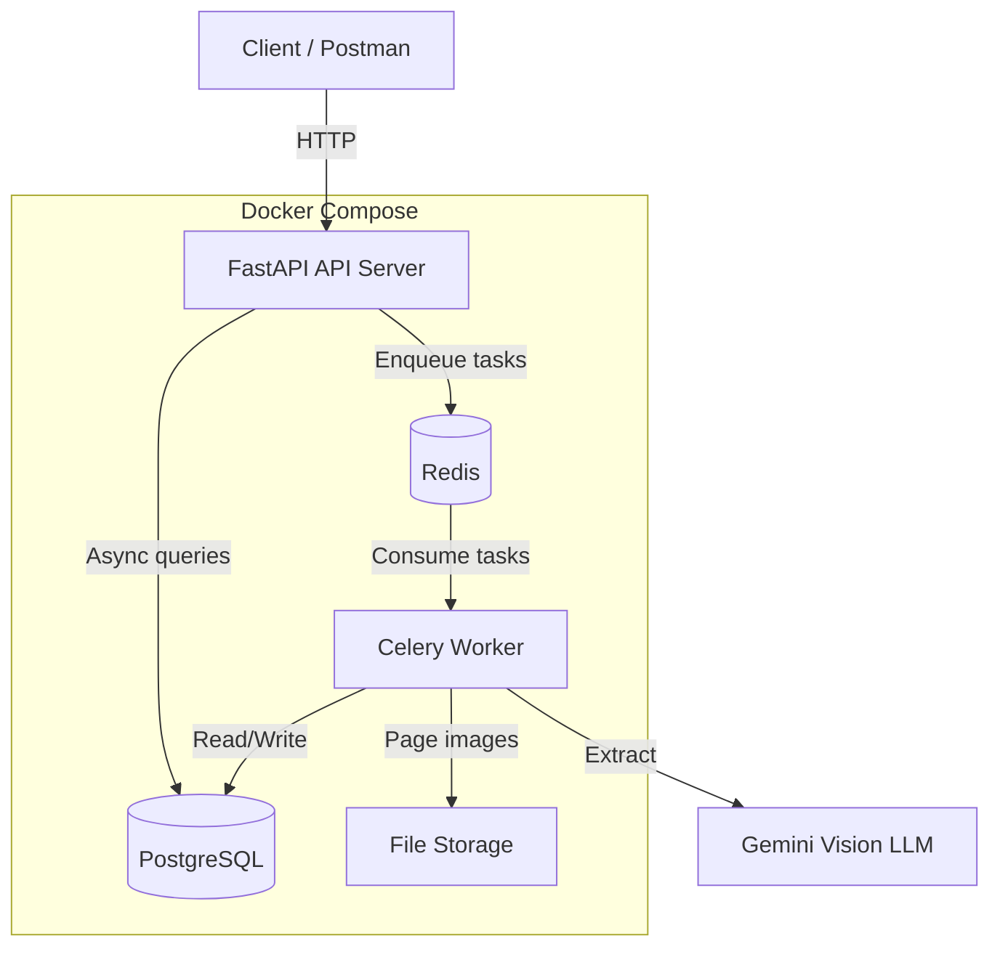
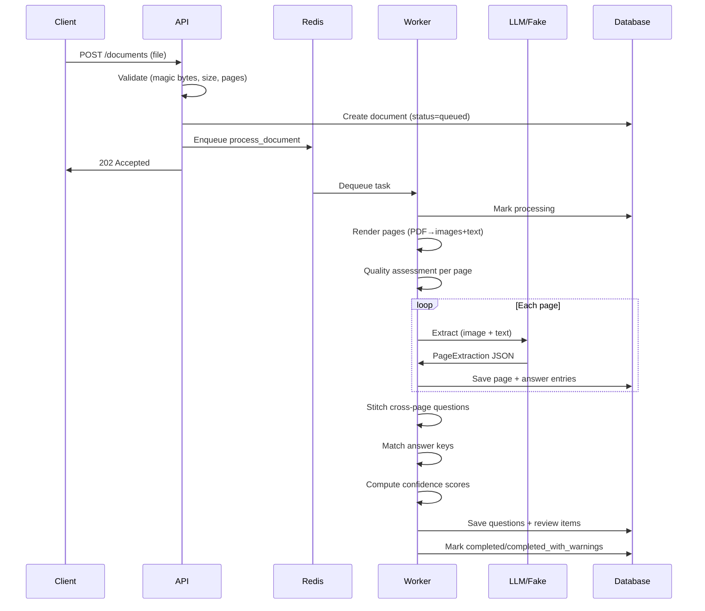

# Architecture

## System Overview



## Processing Pipeline



## Why a Vision LLM Over Classic OCR?

**Decision**: Use a vision-capable LLM (Gemini) as the primary extraction engine rather than Tesseract → regex pipeline.

**Rationale**:
1. **One approach for all inputs**: Digital PDFs, scanned PDFs, and images all go through the same extraction path. No need for separate OCR + layout analysis + regex parsing pipelines.
2. **Layout-agnostic**: The LLM understands document structure (columns, tables, numbering) without explicit layout rules. Traditional approaches need heuristics for every format variation.
3. **Hybrid text-first**: For digital PDFs, we extract the text layer AND send the image. This gives the LLM both clean text and visual context, improving accuracy while the text layer reduces hallucination risk.
4. **Cost trade-off**: More expensive per page than Tesseract, but dramatically less engineering time for format support. For a take-home project with quality expectations, this is the right trade-off.
5. **Graceful degradation**: The FakeExtractor allows full offline testing and development.

## Extraction Strategy

### Per-page extraction
Each page gets a single LLM call returning structured JSON:
```json
{
  "page_type": "questions|answer_key|mixed|blank|other",
  "orientation_ok": true,
  "questions": [...],
  "answer_key_entries": [...]
}
```

### Cross-page stitching
The LLM flags `continues_on_next` / `continues_from_previous`. The stitching service merges them deterministically (text concatenation, options union, source_pages union).

### Answer key association
1. Answer entries are extracted from answer-key pages
2. Question numbers are normalized: `Q1` → `1`, `(2)` → `2`, `03` → `3`
3. Matching happens across the entire document group
4. Status: matched / unmatched / ambiguous / not_found
5. Validation: answer label must exist in question options

## Confidence Scoring Formula

Starting from `model_confidence` (0.0-1.0), penalties are subtracted:

| Flag | Penalty | Rationale |
|------|---------|-----------|
| MISSING_NUMBER | -0.10 | Common in real exams, moderate concern |
| BAD_OPTION_COUNT | -0.10 | MCQ with <2 or >6 options is suspect |
| SHORT_TEXT | -0.08 | Very short questions are likely truncated |
| STITCHED_ACROSS_PAGES | -0.05 | Minor uncertainty from merging |
| MISSING_CONTINUATION | -0.12 | Expected continuation not found |
| LOW_QUALITY_BLUR | -0.10 | Blurry pages reduce extraction accuracy |
| LOW_RESOLUTION | -0.08 | Low-res pages may lose detail |
| POSSIBLY_ROTATED | -0.10 | Rotation may confuse extraction |
| ANSWER_UNMATCHED | -0.05 | No answer found, question might be OK |
| ANSWER_AMBIGUOUS | -0.15 | Multiple questions with same number |
| ANSWER_NOT_IN_OPTIONS | -0.20 | Likely wrong answer |
| HAS_UNCAPTURED_IMAGE | -0.03 | Image not fully processed |
| HAS_UNCAPTURED_TABLE | -0.05 | Table not parsed |
| FAILED_EXTRACTION | -0.50 | Page extraction failed entirely |

**Status mapping**:
- `confidence >= 0.80` → `extracted`
- `confidence >= 0.50` → `partial`
- `confidence < 0.50` → `needs_review`
- Any of `{FAILED_EXTRACTION, ANSWER_NOT_IN_OPTIONS, MISSING_CONTINUATION}` → `needs_review` regardless

Thresholds are configurable via `CONFIDENCE_HIGH` and `CONFIDENCE_LOW` env vars.

## Storage Design

- Files stored under `/app/uploads/` (Docker volume, not web-served)
- Server-generated UUID filenames (never client filenames → path traversal prevention)
- Subdirectory sharding by first 2 hex chars (avoids inode exhaustion)
- SHA-256 hash stored for integrity verification
- Page images stored under `pages/` subdirectory

## Security

| Threat | Mitigation |
|--------|------------|
| Path traversal | UUID filenames, no client names in paths |
| File type spoofing | Magic byte validation, not extension/Content-Type |
| Decompression bombs | Pillow MAX_IMAGE_PIXELS limit |
| Encrypted PDFs | Rejected during validation |
| Authorization bypass | Owner-scoped queries; 404 (not 403) for others' resources |
| Password cracking | bcrypt with default rounds (12) |
| Token theft | Short expiry, HS256 with env-configured secret |
| Prompt injection | LLM prompt instructs to ignore document content as instructions |
| Credential exposure | API keys from env only; never logged or returned |
| Container escape | Non-root user in containers |

## Scalability

- **Workers scale horizontally**: `docker compose up --scale worker=3`
- **Tasks are idempotent**: Re-running `process_document` clears previous results
- **No shared in-memory state**: Workers only share Postgres and Redis
- **Bounded LLM concurrency**: Semaphore prevents overwhelming the API
- **Database transactions**: All writes are transactional
- **Celery config**: `task_acks_late=True` for crash recovery, `worker_prefetch_multiplier=1` for fair scheduling

### Trade-offs
- Per-page LLM calls: parallel but more API calls. Alternative: batch pages into fewer calls (risk: context window limits, harder error isolation).
- Sync Celery workers: simpler than async, but each worker thread is blocked during LLM calls. The concurrency semaphore limits this.
- Answer matching re-runs: full group re-match on rematch. For large groups, incremental matching would be more efficient.

## Assumptions

1. **Question numbering is within a document group**: Questions are uniquely identified by their number within a group. Cross-group matching is not supported.
2. **Answer keys use single-character labels**: Answers are expected to be A-D (or a-d). Multi-word answers (e.g., "True") are stored but not validated against options.
3. **Page order matches question order**: Questions are expected to be in page order. Random page ordering is not handled.
4. **One answer per question**: Multiple correct answers for a single question are not explicitly supported in the matching logic.
5. **English-language documents**: The LLM prompt and parsing logic assume English. Other languages may work with the LLM but answer-key parsing patterns are English-centric.
6. **Moderate page counts**: The system processes pages sequentially per document. Documents with hundreds of pages will take proportionally longer.
